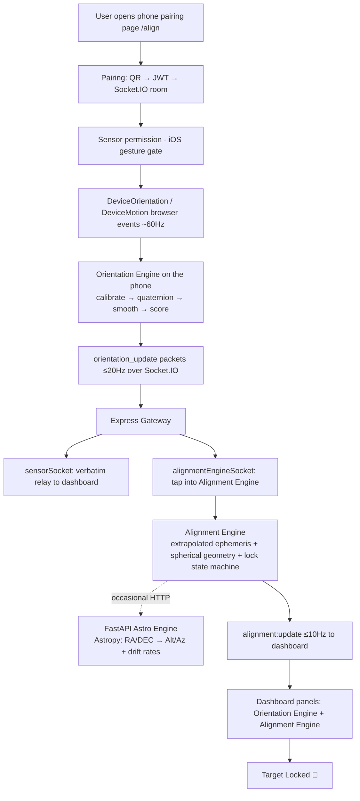
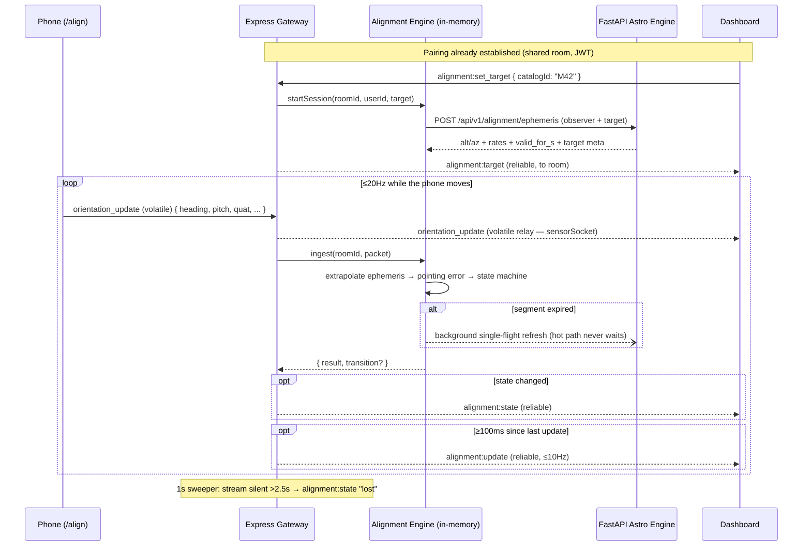

# PHONE_ORIENTATION_EXPLAIN.md

# 🌌 SkyGuide AI — Phone Orientation & Telescope Alignment Engine

> **The complete technical reference for the realtime alignment system.**
>
> This document explains — from first principles — how a phone lying next to a
> telescope becomes a live pointing sensor, and how the platform turns that
> stream into "move the tube 2.3° right, 1.1° up… **Target Locked**".
>
> It documents the **actual implementation** in this repository as of
> Session 14. Every constant, threshold, and event name below is taken from
> the source code, with file references throughout.

**Audience:** developers who know basic programming but have never touched
IMU sensors, quaternions, or positional astronomy. After reading this you
should be able to confidently modify the Orientation Engine and the Alignment
Engine.

---

## Table of Contents

1. [The Big Picture](#1-the-big-picture)
2. [Stage 0 — Pairing: How the Phone Meets the Dashboard](#2-stage-0--pairing)
3. [Stage 1 — Sensor Permission & Acquisition](#3-stage-1--sensor-permission--acquisition)
4. [Stage 2 — The Orientation Engine (on the phone)](#4-stage-2--the-orientation-engine)
5. [Every Field in the Orientation Engine Panel](#5-every-field-in-the-orientation-engine-panel)
6. [Stage 3 — Streaming: Phone → Gateway](#6-stage-3--streaming-phone--gateway)
7. [Stage 4 — The Gateway: Relay + Alignment Tap](#7-stage-4--the-gateway)
8. [Stage 5 — The Astro Engine (FastAPI + Astropy)](#8-stage-5--the-astro-engine)
9. [Stage 6 — The Alignment Engine (on the gateway)](#9-stage-6--the-alignment-engine)
10. [Every Field in the Alignment Engine Panel](#10-every-field-in-the-alignment-engine-panel)
11. [Alignment States & Hysteresis](#11-alignment-states--hysteresis)
12. [Complete Backend Wiring](#12-complete-backend-wiring)
13. [Socket.IO Event Reference](#13-socketio-event-reference)
14. [Performance: Why This Design Scales](#14-performance-why-this-design-scales)
15. [Live Walkthrough — Locking Onto M42](#15-live-walkthrough--locking-onto-m42)
16. [FAQ](#16-faq)
17. [File Map](#17-file-map)

---

# 1. The Big Picture

## The problem

A telescope on a manual alt-azimuth mount has two axes:

- **Azimuth** — where it points on the horizon compass (North, East, South…)
- **Altitude** — how high it points above the horizon

A celestial object (say, the Orion Nebula) has a *fixed* position among the
stars, but because the Earth rotates, its azimuth and altitude **change
continuously** for any observer. To view it, you must point the telescope at
the right (azimuth, altitude) *for your location, right now* — and keep
adjusting as it drifts.

SkyGuide solves this by strapping (conceptually) a phone to the telescope
tube. The phone's motion sensors report which way it — and therefore the
tube — points. The backend computes where the target *should* be, subtracts,
and streams back the correction until the error is under 1°: **locked**.

## The pipeline, end to end



## Division of labour (this is the architecture's core rule)

| Layer | Owns | Never does |
|---|---|---|
| **Phone (React)** | Sensor acquisition, calibration, smoothing, the orientation *model* | Astronomy, alignment math |
| **Express Gateway** | Rooms/auth, relaying, alignment *session state*, ephemeris extrapolation, error geometry, lock state machine | Coordinate astronomy (RA/DEC transforms) |
| **FastAPI Astro Engine** | All astronomy: catalog lookup, Astropy RA/DEC → Alt/Az, drift rates | Realtime per-packet work |
| **Dashboard (React)** | Rendering, target selection | Any math at all |

Per [CLAUDE.md](CLAUDE.md): *the frontend never performs astronomical
calculations; Express never performs astronomy; all science lives in FastAPI.*
The alignment engine's spherical-geometry code on the gateway is deliberately
**not astronomy** — it measures the gap between two already-computed
directions, which is pure geometry (see §9).

---

# 2. Stage 0 — Pairing

*Files: [QRCodeModal.jsx](frontend/src/components/dashboard/QRCodeModal.jsx),
[alignmentController.js](server-gateway/src/controllers/alignmentController.js),
[pairingService.js](server-gateway/src/services/pairingService.js),
[socketMiddleware.js](server-gateway/src/middleware/socketMiddleware.js),
[alignmentSocket.js](server-gateway/src/sockets/alignmentSocket.js),
[PairingContext.jsx](frontend/src/context/PairingContext.jsx),
[Align.jsx](frontend/src/pages/Align.jsx)*

Before a single sensor value flows, the phone and the dashboard must end up in
the same **Socket.IO room**, authenticated as the same user.

## 2.1 The flow

```
Dashboard clicks "Sync Telescope"
        │
        ▼
POST /api/v1/alignment/create-room          (cookie-authenticated REST)
        │  alignmentController.createRoom:
        │    roomId = generateRoomId()
        │    token  = JWT { userId, roomId, type: "mount_pairing" }  (TTL 5 min)
        ▼
Dashboard renders a QR encoding:
        https://<host>/align?room=<roomId>&token=<JWT>
        │
        ▼
Phone scans QR → opens /align
        │  Align.jsx validates the URL params (token must look like a JWT:
        │  /^[\w-]+\.[\w-]+\.[\w-]+$/) before any socket is opened
        ▼
Phone opens a Socket.IO connection with { auth: { token } }
        │  socketMiddleware verifies the JWT at handshake and stores the
        │  decoded payload on socket.user
        ▼
Phone emits join_room { roomId, role: "phone" }
        │  alignmentSocket: roomId MUST equal socket.user.roomId — the token
        │  is bound to exactly one room. On success the server stamps
        │  socket.data.roomId and socket.data.role.
        ▼
Server broadcasts phone_connected to the room
        │
        ▼
Both sides show "Connected" — pairing.status === "connected"
```

Key design points:

- **The room is the source of truth, not connection order.** Whoever joins
  second reconciles against who's already present
  ([alignmentSocket.js:45](server-gateway/src/sockets/alignmentSocket.js#L45)),
  so the dashboard learns about the phone whether the phone joined first,
  second, or reconnected.
- **Identity never comes from packet payloads.** `socket.data.role` and
  `socket.data.roomId` are set server-side after JWT validation; every
  downstream module (sensor relay, alignment engine) trusts only those.
- **The pairing token expires in 5 minutes** (`PAIRING_TOKEN_TTL_SECONDS`),
  but the JWT is only checked at handshake — an already-connected pair
  outlives the countdown. Expiry only blocks *new* connections.
- On both sides, [PairingContext.jsx](frontend/src/context/PairingContext.jsx)
  is the **only** code that touches the pairing socket. It exposes a
  `socketRef` so the sensor/alignment hooks attach their own listeners to the
  *same* connection — one socket per device, ever. On every `connect`
  (including automatic Socket.IO reconnects) it re-emits `join_room`, because
  the server drops room membership when the transport drops.

---

# 3. Stage 1 — Sensor Permission & Acquisition

*Files: [sensor.service.js](frontend/src/services/sensor.service.js),
[SensorPermissionPanel.jsx](frontend/src/components/alignment/SensorPermissionPanel.jsx)*

Once paired, the phone must start reading its motion sensors. Browsers make
this surprisingly hostile territory, and `sensor.service.js` exists purely to
normalize it.

## 3.1 What sensors a phone actually has

A modern phone contains an **IMU** (Inertial Measurement Unit) with three
sensor families:

| Sensor | Measures | Used for |
|---|---|---|
| **Accelerometer** | Linear acceleration incl. gravity | "Which way is *down*" → pitch & roll |
| **Gyroscope** | Angular velocity (deg/s) | Smooth, fast rotation tracking (no absolute reference) |
| **Magnetometer** | Earth's magnetic field | "Which way is *North*" → heading reference |

No single sensor is sufficient: the accelerometer knows down but not North;
the magnetometer knows North but is noisy and slow; the gyro is smooth and
fast but drifts, because it only measures *change*. The OS fuses all three
and exposes the result to the browser as **DeviceOrientation events** —
three angles called `alpha`, `beta`, `gamma`.

## 3.2 The browser landscape (why this module exists)

`getSensorCapability()` returns one of four verdicts, checked in a very
deliberate order:

1. **`insecure_context`** — checked *first*. On plain-HTTP origins Chrome
   removes the DeviceOrientation/DeviceMotion interfaces from `window`
   entirely. If we checked API presence first, an insecure context would be
   misreported as "unsupported" and hide the actionable fix (use HTTPS — this
   is why the project's Cloudflare tunnel exists). This is also why the
   `/align` page shows *"Motion sensors require a secure (HTTPS) connection"*.
2. **`unsupported`** — neither event interface exists (typical desktop).
3. **`needs_permission`** — iOS Safari 13+: `DeviceOrientationEvent.
   requestPermission` is a function. The prompt **must** be triggered from a
   user gesture, which is why the phone UI shows an explicit
   **"Enable Motion Sensors"** button instead of asking automatically.
4. **`auto`** — Android/desktop Chrome: listeners can attach immediately.

Even on "auto" platforms, events can be **silently withheld** — so
`createSensorEngine().start()` runs a **first-event probe**: after attaching
listeners it waits `PROBE_TIMEOUT_MS = 1500 ms` and then reports which sensor
groups actually delivered an event. That result is what the dashboard's
"waiting for orientation data" messaging keys off.

## 3.3 Which event the engine listens to

```js
const orientationEventName =
  "ondeviceorientationabsolute" in window
    ? "deviceorientationabsolute"   // Chrome/Android: compass-referenced alpha
    : "deviceorientation";          // everyone else
```

This one line matters enormously for heading (see §5 North Reference):
`deviceorientationabsolute` gives an `alpha` already fused against the
magnetometer by the OS — 0 means North, period. Plain `deviceorientation` on
iOS gives an `alpha` whose zero is **wherever the phone happened to point
when the sensors woke up** — a compass correction has to be applied later.

The acquisition engine also listens to `devicemotion` for
`rotationRate` (gyroscope, deg/s), which the Orientation Engine uses to make
smoothing adaptive (§4.4).

Listeners run at native rate (~60 Hz) writing into plain variables — no React
state, no allocation storms. Per-event callbacks (`onOrientation`,
`onMotion`) push every sample straight into the Orientation Engine.

---

# 4. Stage 2 — The Orientation Engine

*Files: [orientationEngine.js](frontend/src/services/orientation/orientationEngine.js),
[orientationMath.js](frontend/src/services/orientation/orientationMath.js),
[headingCalibration.js](frontend/src/services/orientation/headingCalibration.js)*

This is the heart of the phone side: a **pure JavaScript state machine** (no
browser APIs, no React) that turns raw, noisy, browser-flavored sensor events
into a stable, calibrated, device-independent **orientation model**.
Everything downstream — streaming, alignment, the future AI copilot —
consumes the model, never raw events.

## 4.1 The pipeline, per sample

```
raw DeviceOrientation event {alpha, beta, gamma, absolute, compassHeading…}
        │
        ▼
 1. validate            (all-null samples dropped)
        │
        ▼
 2. heading calibration (alpha += offset — pin heading to true North)
        │
        ▼
 3. quaternion          (Euler ZXY → quaternion, gimbal-lock-free)
        │
        ▼
 4. screen adjust       (rotate for landscape/portrait so "aim" is stable)
        │
        ▼
 5. adaptive smoothing  (nlerp filter; strength follows angular velocity)
        │
        ▼
 6. angles + confidence (heading / pitch / roll / quality assessment)
        │
        ▼
     snapshot() — the orientation model
```

## 4.2 What alpha/beta/gamma mean, and why we don't use them directly

The W3C DeviceOrientation spec describes the phone's rotation as three
sequential **Euler angles** applied intrinsically in Z-X'-Y'' order:

- **alpha** (0–360°): rotation about the phone's *z* axis (out of the screen)
- **beta** (−180–180°): rotation about *x* (across the screen)
- **gamma** (−90–90°): rotation about *y* (along the screen)

Euler angles are human-readable but mathematically treacherous:

- **Gimbal lock:** when the phone points straight up (the *zenith* — exactly
  where telescopes point!), two of the three rotation axes align and one
  degree of freedom vanishes. Angles snap and flip wildly even though the
  phone barely moved.
- **Wraparound:** 359° → 1° is a 2° move that looks like −358°. Averaging or
  smoothing raw angles across the wrap produces garbage.
- **Order-dependence:** the same physical orientation has multiple
  angle-triple representations.

So the engine converts each sample into a **quaternion** immediately
(`quatFromDeviceEuler`, [orientationMath.js:29](frontend/src/services/orientation/orientationMath.js#L29))
and does *all* processing in quaternion space. Angles are only extracted at
the very end, for display and for the alignment comparison.

## 4.3 Quaternions in one page (no advanced math)

A quaternion is four numbers `{w, x, y, z}` that together encode a single
rotation: **an axis to rotate around, and how far to rotate**. Think of it as
"grab the phone, skewer it on this axis, twist by this angle" — one clean
operation instead of three chained ones.

Why they're the right representation here:

- **No gimbal lock.** There is no privileged axis order, so nothing snaps at
  the zenith — critical because telescope targets near the zenith are common.
- **Smoothing is well-defined.** Blending two quaternions
  (`quatSmooth` uses **nlerp** — normalized linear interpolation, ≈ the exact
  spherical interpolation for the small per-frame steps this filter takes,
  at a fraction of the cost) always produces a valid in-between rotation.
  Blending Euler angles across the 0/360 wrap does not.
- **Double cover:** `q` and `−q` represent the same rotation. Every
  comparison and blend in `orientationMath.js` is "double-cover aware" — it
  flips the sign when the dot product is negative so it always takes the
  short way around.
- **Lossless streaming.** The quaternion is included verbatim in every
  streamed packet as the preferred form for future consumers (3D sky
  rendering, sensor fusion); heading/pitch/roll are the lossy, human-readable
  projection.

### Frames and conventions (fixed in `orientationMath.js`, used everywhere)

- **World frame (ENU):** x = East, y = North, z = Up.
- **Device frame:** x = right edge, y = top edge, z = out of the screen —
  always relative to the phone's *natural portrait* orientation, because
  browsers never remap orientation events for screen rotation.
- **Screen frame:** device frame rotated by `screen.orientation.angle`, so
  "up" means the top of what the user currently sees. `screenAdjust()`
  applies this — without it, rotating the phone to landscape would appear as
  a 90° roll/heading jump even though the telescope didn't move.
- **Aim vector: −z of the screen** — out of the **back** of the phone, where
  the rear camera looks. This is the direction we treat as "where the
  telescope points": lay the phone flat against the tube, screen facing you,
  and the back of the phone faces the same way as the aperture.

## 4.4 Adaptive smoothing

Raw sensor fusion output jitters by a fraction of a degree even on a table.
Naive fixes both fail:

- Heavy fixed smoothing → the display lags seconds behind a real slew.
- No smoothing → the heading readout flickers and lock decisions strobe.

The engine uses a **complementary-style adaptive filter**
([orientationEngine.js:104](frontend/src/services/orientation/orientationEngine.js#L104)):
each new sample is blended into the running estimate with a factor `k` that
scales with **angular velocity**:

```
k = clamp( 0.10 + velocity_deg_per_s / 120 ,  0.10 … 0.85 )
```

- Phone **still** → velocity ≈ 0 → `k ≈ 0.10` → noise is crushed (each new
  sample only nudges the estimate 10% of the way).
- Phone **slewing fast** → `k → 0.85` → near passthrough, no perceptible lag.

Velocity comes from the **gyroscope** (`devicemotion.rotationRate` magnitude)
when available — gyros measure velocity directly and cleanly — with the
quaternion-to-quaternion delta as the fallback (`quatAngleDeg / dt`).

The engine also tracks **jitter**: the average deviation of angular velocity
from its own average. Noise makes velocity erratic; a deliberate smooth slew
keeps it steady — so `jitterDegS > 8` flags a genuinely noisy sensor without
punishing intentional motion. Jitter feeds confidence (§5).

## 4.5 The snapshot (the orientation model)

`snapshot(now)` returns either the current model or **`null`**. Null is a
feature: if no sample arrived for `STALE_INPUT_MS = 1500 ms`, the engine
refuses to serve — *a frozen-but-live-looking orientation is worse than
none*. This "withhold rather than lie" rule repeats at every layer of the
system (phone engine, dashboard feed, alignment sweeper).

```json
{
  "quaternion": { "w": 0.7071, "x": 0.7071, "y": 0, "z": 0 },
  "heading": 271.25,
  "pitch": 17.8,
  "roll": -4.9,
  "gimbal": false,
  "confidence": "high",
  "calibration": { "status": "calibrated", "source": "absolute",
                   "quality": "high", "offset": 0 },
  "inputRateHz": 58.3
}
```

---

# 5. Every Field in the Orientation Engine Panel

The dashboard's **Orientation Engine** card
([OrientationPanelCard.jsx](frontend/src/components/dashboard/OrientationPanelCard.jsx))
displays the streamed model plus transport statistics. Field by field:

## 5.1 Heading

**What it is.** The compass direction of the phone's **aim vector** (back
camera), in degrees **clockwise from North**: 0° = North, 90° = East,
180° = South, 270° = West.

**How it's calculated.** The screen→world quaternion rotates the aim vector
`[0, 0, −1]` into world (East-North-Up) coordinates; heading is then
`atan2(east_component, north_component)`
([orientationMath.js:139](frontend/src/services/orientation/orientationMath.js#L139)).

**What changes it.** Rotating the phone **left or right on a flat plane**
(like turning your whole body while holding it). Tilting up/down does *not*
change heading (that's pitch); twisting around the aim axis does not either
(that's roll).

**Why it becomes telescope azimuth.** An alt-az mount's horizontal axis *is*
a compass bearing. With the phone mounted parallel to the tube, phone heading
= tube azimuth. The Alignment Engine consumes it directly as
`telescope.heading`.

**How North is determined & how calibration affects it.** See North
Reference and Offset below — heading is only as good as its North reference.
On a device with no compass, heading is *internally consistent* but its zero
is arbitrary, and the backend caps alignment confidence accordingly.

## 5.2 Pitch

**What it is.** The altitude of the aim vector: **−90°** (pointing at the
ground) through **0°** (horizon) to **+90°** (zenith, straight up).

**How it's calculated.** `asin(z-component of the aim vector)` — the
fraction of the aim pointing "up" in the world frame.

**What changes it.** Tilting the phone's back **upward toward the sky**
raises pitch. Note the aim is the *back* of the phone: holding the phone
screen-up flat on a table means the aim points at the ground, pitch ≈ −90°;
pointing the rear camera at a star means pitch = that star's altitude.

**Why it's needed.** It maps 1:1 onto telescope **altitude**, the second
axis of an alt-az mount. Pitch is self-referencing — gravity defines it — so
unlike heading it needs no calibration and works identically on every device.

## 5.3 Roll

**What it is.** Rotation of the screen's "up" edge **around the aim
vector**, −180…180°, positive clockwise from the user's point of view.
Twisting the phone like a steering wheel while keeping it aimed at the same
point changes only roll.

**Why it's mostly ignored.** Pointing a telescope is a two-degree-of-freedom
problem: azimuth + altitude fully determine where the tube looks. Rolling
the phone around the tube's axis doesn't move the aim, so the Alignment
Engine never reads roll. It's displayed for diagnostics (a wildly changing
roll while the phone is clamped indicates a mounting or sensor problem).

**When it becomes important.** Near the zenith/nadir and in the future: field
rotation for astrophotography, level-detection for mount setup, and the
`gimbal` flag case — above |pitch| > 85° the world-up vector no longer spans
a stable reference plane for roll, so the engine switches the roll reference
to North and marks the model `gimbal: true` (the panel shows a `*` beside
Roll). Heading/pitch stay valid; only roll's *meaning* changes.

## 5.4 Quaternion

The panel shows the raw `{w, x, y, z}` screen→world quaternion — the lossless
form of the whole orientation (§4.3). It's displayed so a developer can
verify the stream carries the full rotation, not just the three projected
angles, and it's the value future 3D consumers should prefer.

## 5.5 Confidence

**What it is.** The engine's own honesty rating of its estimate:
`initializing | low | medium | high`
([orientationEngine.js:135](frontend/src/services/orientation/orientationEngine.js#L135)).

**How it's computed** (in priority order):

| Condition | Confidence |
|---|---|
| Fewer than 8 samples ingested, or calibration still initializing | `initializing` |
| Input rate < 5 Hz **or** jitter > 8°/s | `low` |
| Calibration `unreferenced` or `degraded` (heading zero uncertain) | `medium` |
| Otherwise | `high` |

**When it decreases.** Sensors delivering slowly (browser throttling,
low-power mode), erratic readings (magnetic interference, cheap IMU), or a
lost/degraded North reference (iOS compass gone stale, accuracy worse than
35°).

**How the backend uses it.** It's the *base* of the alignment confidence
score: `high → 95, medium → 75, low → 45, initializing → 20` points, before
the backend applies its own penalties (§10.5). Note browsers don't expose a
confidence value themselves — the only browser-provided quality signal is
iOS's `webkitCompassAccuracy`, which feeds calibration quality; everything
else here is derived by our engine from observed behavior.

## 5.6 Calibration (status)

**Why calibration exists.** Pitch and roll calibrate themselves against
gravity. **Heading cannot** — it needs an external North reference, and
browsers disagree on providing one (§5.7). The calibration state machine
([headingCalibration.js](frontend/src/services/orientation/headingCalibration.js))
manages that reference and reports how trustworthy it is.

**Statuses:**

- `initializing` — fewer than 3 samples seen.
- `calibrated` — a live, good-quality North reference is in effect.
- `degraded` — the reference exists but is stale (no compass input for
  \>10 s) or low quality (iOS accuracy worse than 35°).
- `unreferenced` — no compass at all; heading is *relative* (consistent, but
  0° means "wherever the session started", not North).

**How the process works.** There is no user-facing "wave your phone in a
figure-8" step in SkyGuide — calibration is continuous and automatic. Every
sample is fed to `calibration.ingest()`, which maintains the offset (§5.8).
(The OS may still ask the user to move the phone if *its* magnetometer fusion
is uncalibrated — that manifests here as poor `compassAccuracy`.)

**Why heading becomes stable afterwards.** The correction pins alpha's zero
to North *once*, then relies on the OS's gyro-continuous alpha for smooth
tracking. The compass only re-pins the reference (slowly), so compass noise
never wobbles the displayed heading.

## 5.7 North Reference (source)

**The problem.** The same physical orientation produces different `alpha`
values on different platforms:

| Source shown | Platform behavior | Correction |
|---|---|---|
| `absolute` | Android Chrome fires `deviceorientationabsolute`, whose alpha is already OS-fused against the magnetometer: 0 = North. Authoritative. | offset forced to **0** |
| `compass` | iOS Safari's alpha has an **arbitrary zero**, but events carry `webkitCompassHeading` (magnetic heading of the device top) + `webkitCompassAccuracy`. | maintain a smoothed alpha offset against the compass |
| `none` | No compass data at all (desktop, some browsers). | none possible → `unreferenced` |

**Absolute vs Relative.** An *absolute* frame is anchored to the real world
(North is North). A *relative* frame is anchored to the session start. The
W3C spec allows both, which is why this abstraction exists: SkyGuide detects
which it got and either trusts it (`absolute`), corrects it (`compass`), or
labels it honestly (`none` → the panel shows "No North Ref" and the backend
caps alignment confidence at 30, because comparing an arbitrary-zero heading
to a real azimuth is meaningless).

## 5.8 Offset

**What it represents.** The degrees **added to raw alpha** before the
quaternion is built — the correction that rotates the browser's arbitrary
frame onto true North. On Android (`absolute`) it's 0 by definition. On iOS
it's the discrepancy between what the compass says and what alpha says.

**How it's computed** ([headingCalibration.js:63](frontend/src/services/orientation/headingCalibration.js#L63)).
`webkitCompassHeading` is clockwise-from-North while alpha is
counterclockwise, so a perfectly referenced alpha would equal
`360 − compassHeading`. The target offset is the circular difference between
that and the actual alpha:

```
target = circularDelta(360 − compassHeading, alpha)
```

- First reading, or a jump beyond `SNAP_THRESHOLD_DEG = 25°` → **snap**
  (the old offset was simply wrong — e.g. a magnetic disturbance passed).
- Otherwise → drift toward the target with a slow EMA
  (`OFFSET_SMOOTHING = 0.05`).

**Why it stays constant.** The offset corrects a *frame misalignment*, not
the motion — and the frame misalignment is fixed for the session (alpha's
arbitrary zero doesn't move). The slow EMA means compass noise barely
perturbs it, so once settled you'll see it sit still to within a degree.
A visibly *changing* offset means the compass and the gyro-integrated alpha
disagree — usually magnetic interference.

## 5.9 Sensor Rate (e.g. "57 Hz")

**What it is.** The measured arrival rate of raw DeviceOrientation events at
the engine — `inputRateHz`, an exponential moving average of `1000/Δt`
between consecutive samples ([orientationEngine.js:74](frontend/src/services/orientation/orientationEngine.js#L74)).

**Where "57" comes from.** Phones typically deliver orientation at their
display/IMU rate, nominally 60 Hz. The EMA plus real-world timer jitter and
occasional dropped frames lands the estimate just under nominal — 57–59 Hz is
a healthy reading. It absolutely depends on the phone: some devices deliver
at 50 Hz, browsers throttle background/low-power tabs, and high-refresh
phones may exceed 60.

**Why it matters.** It's a *sensor health* signal (an input to confidence:
< 5 Hz → `low`) and it's the number that makes the next field make sense.

## 5.10 Stream Rate (vs Sensor Rate)

**What it is.** How many `orientation_update` packets per second the
*dashboard* actually received, measured over a 2 s sliding window
([useOrientationFeed.js:99](frontend/src/hooks/useOrientationFeed.js#L99)).

**Why the two rates differ — by design.** The phone ingests every raw sample
(≈60 Hz) but emits on a separate 20 Hz loop (`TARGET_HZ = 20`), and even then
**deduplicates**: a packet is only sent when

1. the estimate rotated ≥ `EMIT_MIN_ANGLE_DEG = 0.15°` since the last packet
   (quaternion-space comparison — wrap-safe), **or**
2. confidence/calibration metadata changed, **or**
3. `KEEPALIVE_MS = 500 ms` passed with no emission (liveness heartbeat).

So the expected readings are: phone at rest → **~2/s** (pure keepalive);
phone slewing → **~20/s**. Stream rate deliberately *tracks motion*.

**Why deduplication exists.** A resting phone produces near-identical models
60 times a second. Transmitting them wastes radio, battery, and gateway CPU
while conveying zero information — the dashboard can't tell identical poses
apart anyway. The keepalive preserves the one thing continuous traffic did
provide: proof the stream is alive.

## 5.11 Dropped (packets)

**What it counts.** Gaps in the packet sequence number: every
`orientation_update` carries a monotonically increasing `seq`; when the
dashboard sees `seq` jump by more than 1, the difference is added to the
counter ([useOrientationFeed.js:68](frontend/src/hooks/useOrientationFeed.js#L68)).

**Why drops happen and why they're harmless.** The phone emits these packets
with `socket.volatile.emit(...)`, and the gateway relays them volatile too.
**Volatile** is Socket.IO's "fire and forget" mode: if the transport buffer
is congested, the packet is discarded instead of queued. For a pose stream
this is the correct trade — a stale pose delivered late is *worse* than a
dropped one, because the next snapshot is ≤50 ms away and supersedes it
anyway. Late-but-guaranteed delivery would make the display rubber-band.

A small, slowly growing count under motion is normal (congestion moments,
Wi-Fi hiccups). A rapidly climbing count signals real network trouble —
which is why the panel turns the number red when > 0, as a nudge to look.

Note Socket.IO's *reliable* (default) events — `sensor_status`,
`alignment:target`, `alignment:state` — are never dropped this way; only the
high-rate volatile streams are.

## 5.12 Last Update

**What it is.** Milliseconds since the dashboard received the most recent
`orientation_update` — `now − lastArrival`, recomputed at each 4 Hz UI commit.

**What it represents.** It is **stream freshness**, not network latency (the
phone and dashboard clocks aren't synchronized, so true one-way latency isn't
measurable from `t`). Healthy values oscillate between ~0 and ~500 ms (the
keepalive interval). If it exceeds `STALE_MS = 2000 ms` the feed declares the
stream **stale**, *withholds the model entirely* (shows "Stale", not frozen
numbers), and the alignment engine independently flags the session `lost`
at 2.5 s (§11).

---

# 6. Stage 3 — Streaming: Phone → Gateway

*File: [useOrientationStream.js](frontend/src/hooks/useOrientationStream.js)*

`useOrientationStream` is the phone-side lifecycle conductor. It owns nothing
mathematical — it wires the acquisition engine into the orientation engine and
runs the emit loop:

```
sensor.service (native-rate events)
      │  onOrientation → engine.ingestOrientation({...sample, screenAngle, at})
      │  onMotion      → engine.ingestRotationRate(rot)
      ▼
orientationEngine (calibrate, smooth, score)
      ▼
20Hz emit loop → maybeEmit():
      snapshot → moved ≥0.15°? meta changed? keepalive due?
      → socket.volatile.emit("orientation_update", { v:1, seq, t, ...model })
```

Key behaviors:

- **Armed by pairing + permission.** The whole effect keys off
  `pairing.status === "connected" && permission === "granted"`. Reconnects
  re-arm it automatically.
- **Visibility handling.** When the phone screen turns off or the tab
  backgrounds, the stream *stops entirely* (listeners detached, engine
  reset), emits `sensor_status { reason: "background" }` reliably so the
  dashboard can explain the silence, and resumes on wake. Sensors don't
  deliver in background anyway; stopping cleanly beats streaming a frozen
  pose.
- **`sensor_status` lifecycle events** (reliable, not volatile) mark the rare
  transitions: `started`, `probed` (with which sensor groups actually
  deliver), `background`, `stopped`, `permission_denied`.
- **React isolation.** Nothing per-frame touches React state. The phone's own
  little readout gets a 4 Hz digest (`display`), and even that keeps the
  previous object identity when values didn't visibly change, so a resting
  phone doesn't re-render at all.
- The packet is versioned (`v: 1`) and stamped with `seq` (drop detection)
  and `t` (phone epoch ms).

---

# 7. Stage 4 — The Gateway

*Files: [sensorSocket.js](server-gateway/src/sockets/sensorSocket.js),
[alignmentEngineSocket.js](server-gateway/src/sockets/alignmentEngineSocket.js)*

One inbound `orientation_update` event fans out to **two independent
modules** — Socket.IO happily delivers one event to multiple listeners:

## 7.1 sensorSocket — the transport-only relay

Relays the packet **verbatim** to the rest of the room (i.e., the dashboard):
no storage, no transformation, no math. Guards:

- Sender must have `socket.data.role === "phone"` and a joined room
  (identity from the JWT-validated `join_room`, never from the payload).
- Payloads over `MAX_PACKET_BYTES = 2048` are dropped silently (a v1 frame is
  ~400 bytes serialized; anything bigger is malformed or hostile).
- Relay is **volatile** — same reasoning as the phone's emit.
- Invalid packets are dropped without an error reply: at 20 Hz, answering
  each bad frame would just amplify traffic.

This relay is what feeds the dashboard's **Orientation Engine** panel.

## 7.2 alignmentEngineSocket — the engine tap

Registers its **own** `orientation_update` listener and feeds each packet
into the Alignment Engine (§9). If the engine returns a result, it emits:

- `alignment:state` (reliable) — only when the state machine transitioned.
- `alignment:update` (reliable, throttled to `ALIGNMENT_EMIT_MS = 100 ms`,
  i.e. ≤10 Hz) — the full enriched packet, sent `socket.to(roomId)` so it
  flows **dashboard-ward only** (the phone sender is excluded; it doesn't
  need its own data back).

**Why `alignment:update` is deliberately NOT volatile** (a hard-won lesson,
documented in [WEBSOCKET_PROTOCOL.md](WEBSOCKET_PROTOCOL.md) and the memory
notes): it's emitted in the *same tick* as sensorSocket's volatile relay of
the same inbound packet. That relay has just written to the transport, so a
volatile packet here reliably finds the buffer busy and is dropped —
**100% loss, verified during Session 14 testing**. At ≤10 Hz × ~300 bytes,
guaranteed delivery costs nothing.

This module also owns session lifecycle: `alignment:set_target` /
`alignment:clear_target` handlers (dashboard-role only), a 1 s **sweeper**
that flags silent streams as `lost`, and garbage collection — on disconnect,
if the room is empty, the session is cleared.

---

# 8. Stage 5 — The Astro Engine

*Files: [alignment_service.py](astro-engine/app/services/alignment_service.py),
[alignment.py](astro-engine/app/api/v1/alignment.py),
[coordinate_service.py](astro-engine/app/services/coordinate_service.py),
[catalog_service.py](astro-engine/app/services/catalog_service.py)*

All the astronomy lives here, behind one endpoint:

```
POST /api/v1/alignment/ephemeris
{ latitude, longitude, elevation, catalog_id | (ra, dec, name), time? }
```

## 8.1 From a name to coordinates: the catalog

If the request carries a `catalog_id` (e.g. `"M42"`), the endpoint resolves
it via `catalog_service.get_object_by_catalog_id` — a case-insensitive
MongoDB lookup returning the object's name, type, and **ICRS coordinates**
(`ra_deg`, `dec_deg`). Unknown ids → HTTP 404, which the gateway's client
maps to the `TARGET_NOT_FOUND` error code.

**RA/DEC in one paragraph.** Celestial objects are cataloged in the
**equatorial** system: *Right Ascension* (RA, the sky's "longitude") and
*Declination* (DEC, the sky's "latitude"), in the ICRS frame — anchored to
the stars, not the Earth. M42's RA/DEC is effectively constant for our
purposes. What changes every second is how that fixed point projects onto
*your* local sky.

## 8.2 RA/DEC → Alt/Az: what Astropy does

`compute_ephemeris()` performs the classic transformation chain:

```
Observer (lat, lon, elevation)  ──►  astropy EarthLocation
Target (RA, DEC, ICRS)          ──►  astropy SkyCoord
Current UTC time                ──►  astropy Time
                                        │
                    target.transform_to(AltAz(obstime, location))
                                        │
                                        ▼
                          altitude (deg), azimuth (deg)
```

Conceptually: the Earth's rotation state at time *t* (sidereal time) plus the
observer's latitude/longitude fully determine where any RA/DEC lands in the
local horizontal frame. Astropy handles the hard parts — precession,
nutation, Earth-orientation — that a hand-rolled formula would get subtly
wrong. Azimuth is measured **East of North** (0=N, 90=E), matching the
phone's heading convention exactly; that's not a coincidence, it's the
contract (`alignmentMath.js` header, `coordinate_service.py` docstring).

## 8.3 Drift rates: the trick that makes realtime cheap

One transform gives a position that's stale the moment it's computed (the sky
moves ~0.004°/s). Instead of being called per packet, the service evaluates
the target at **two times** — `t0` and `t0 + 30 s` (`EPHEMERIS_STEP_S`) — in
a single vectorized transform, and returns finite-difference **rates**:

```json
{
  "utc_time": "2026-07-08T21:14:03.120",
  "altitude_deg": 24.29401,
  "azimuth_deg": 284.93712,
  "altitude_rate_deg_s": 0.00279,
  "azimuth_rate_deg_s": 0.00195,
  "valid_for_s": 25.6,
  "above_horizon": true,
  "target": { "catalog_id": "M42", "name": "Orion Nebula", ... }
}
```

(The azimuth difference is taken *on the circle* so a target crossing North
doesn't produce a ±360°/step spike.)

**`valid_for_s`** is how long the gateway may linearly extrapolate this
segment before re-asking. It's adaptive: budgeting ≤0.05° of extrapolation
error, `window = 0.05 / |az_rate|`, clamped to **15–120 s**. Slow targets
(near the celestial pole) get long windows; targets whipping past near the
zenith (where azimuth rate blows up) get short ones. Sidereal motion is
≤ ~0.005°/s away from the zenith, so a linear segment stays well under 0.01°
of error over a typical window — far below the 1° lock threshold.

---

# 9. Stage 6 — The Alignment Engine

*Files: [alignmentEngine.js](server-gateway/src/services/alignmentEngine.js),
[alignmentMath.js](server-gateway/src/utils/alignmentMath.js),
[astroEngineClient.js](server-gateway/src/services/astroEngineClient.js)*

The gateway-side engine continuously answers **"how far is the telescope from
the target?"** It is transport-agnostic (never touches Socket.IO — the socket
layer feeds packets in and decides what to emit) and keeps sessions **purely
in memory**, keyed by pairing room.

## 9.1 Session start (`alignment:set_target`)

`startSession({ roomId, userId, target })`:

1. Loads the user and requires an **observer location** (GeoJSON
   `[longitude, latitude]` — note the swap when unpacking; `(0,0)` counts as
   unset). Missing → error code `NO_OBSERVER`; you cannot compute Alt/Az
   without knowing where on Earth you stand.
2. Loads the telescope profile **as context only** — alignment works fine
   with no saved telescope (spec: "No Telescope" must not crash).
3. Fetches the **first ephemeris segment** from FastAPI (via
   `astroEngineClient.fetchEphemeris`, 4 s timeout, errors normalized to the
   stable codes `TARGET_NOT_FOUND | ENGINE_REJECTED | ENGINE_UNAVAILABLE`).
4. Stores the session: observer, target, ephemeris (stamped with a local
   `epochMs` parsed from its UTC time), state `"searching"`.

Retargeting simply replaces the session in place.

## 9.2 The hot path: `ingest()` — one packet in, one comparison out

Called synchronously for **every** orientation packet. Cost: microseconds —
one extrapolation, one great-circle separation, no allocations of note, no
awaits. Steps:

1. **Validate** — `heading` and `pitch` must be finite numbers.
2. **`maybeRefreshEphemeris`** — if the segment has outlived `valid_for_s`,
   kick off a **background, single-flight** refresh. The hot path never
   waits: the old segment keeps extrapolating while the new one is in
   flight. On failure, retry no sooner than 5 s later and let confidence
   degrade instead of stalling.
3. **Extrapolate** the target's current position:
   `alt = alt₀ + alt_rate·age`, `az = wrap(az₀ + az_rate·age)`
   ([alignmentMath.js:78](server-gateway/src/utils/alignmentMath.js#L78)).
4. **Pointing error** (§10.3–10.5).
5. **State machine** step (§11), **confidence score** (§10.6).
6. Return the enriched result + any state transition for the socket layer.

## 9.3 Why the gateway does geometry but not astronomy

Measuring the angle between two directions on a sphere requires no knowledge
of stars, time, or Earth — it's the same math as distance between two GPS
points. Computing *where the target is* requires ephemerides, sidereal time,
precession — that's astronomy, and it stays in Python/Astropy. The boundary
is: **FastAPI produces (alt, az, rates); the gateway only consumes them.**

---

# 10. Every Field in the Alignment Engine Panel

The dashboard's **Alignment Engine** card
([AlignmentPanelCard.jsx](frontend/src/components/dashboard/AlignmentPanelCard.jsx))
renders the ≤10 Hz `alignment:update` stream, committed to React at 4 Hz via
[useAlignmentFeed.js](frontend/src/hooks/useAlignmentFeed.js). Field by field:

## 10.1 Target Alt / Target Az

**What they are.** Where the target *is*, right now, in the observer's local
horizontal frame — computed by Astropy (§8.2) and linearly extrapolated by
the gateway between refreshes (§8.3).

**Why Target Az changes continuously.** The Earth rotates 360° per sidereal
day (~23h56m); to a ground observer, the entire sky slides westward at up to
~15 arcsec/s. So azimuth (and altitude) drift steadily — for a mid-sky target
roughly 0.2–0.3° per minute. Watch either number for a minute and you'll see
the last decimals tick — that's the extrapolation running per packet.

**How often FastAPI recomputes.** Only when the segment expires — every
`valid_for_s` seconds (15–120 s, rate-adaptive), *not* per packet. Between
refreshes, the interpolation (technically linear **extrapolation** from the
segment epoch) supplies per-packet freshness at nanosecond cost.

## 10.2 Scope Heading / Scope Pitch

**Where they come from.** Verbatim from the most recent `orientation_update`
packet — they *are* the phone's calibrated heading and pitch (§5.1, §5.2),
echoed back so the dashboard shows exactly the inputs the error math used.
Calibration on the phone therefore flows straight through: an iOS compass
offset correction moves Scope Heading identically.

They're labeled "Scope" because the mounted phone is the telescope's proxy:
phone aim = tube aim, by mounting assumption.

## 10.3 Horizontal Error (Δ)

**Definition** ([alignmentMath.js:66](server-gateway/src/utils/alignmentMath.js#L66)):

```
horizontalError = circularDelta(targetAz − scopeHeading)   // wrapped to ±180°
```

The wrap matters: target at az 5°, scope at 355° → error is **+10°**, not
−350°.

**Sign convention — "degrees the telescope must move":**

- **Positive → rotate clockwise** (to the right, as you face the sky). The
  target is clockwise of where you point.
- **Negative → rotate counterclockwise** (left).

The panel renders it with an explicit sign (`+2.30°`) and footnotes
*"Positive Δ = move clockwise / raise the tube."*

## 10.4 Vertical Error (Δ)

```
verticalError = targetAlt − scopePitch
```

No wrapping needed — altitude lives on −90…+90.
**Positive → raise the tube** (target is above your aim);
**negative → lower it**.

## 10.5 Angular Error

**What it is.** The **single true measure** of how far off you are: the
great-circle separation between the aim direction and the target direction on
the sky sphere. This — not the two components — drives the lock state
machine.

**Why it is NOT `sqrt(h² + v²)`.** That formula treats azimuth and altitude
as a flat grid, but the sky is a sphere and **azimuth lines converge toward
the zenith** — exactly like meridians converging at the Earth's poles. At
altitude 80°, a 10° azimuth gap is only ~1.7° of actual sky
(`≈ 10° × cos 80°`). The flat formula would report a huge error for a
telescope that's practically on target; near the zenith it can overstate the
error by an order of magnitude. Conversely `horizontal_error` can legitimately
read large while `angular_error` is tiny — the components are the
*decomposition* (what each mount axis must travel), the angular error is the
*truth*.

**Why the Vincenty-style formula.** Great-circle separation has a textbook
form, `arccos(sin a₁ sin a₂ + cos a₁ cos a₂ cos Δaz)`, but `arccos` is
numerically catastrophic exactly where we care most: for tiny separations its
argument crushes into the flat top of the cosine curve near 1.0, where
float64 has almost no resolution — sub-0.1° errors come out quantized or
zero. The implementation
([alignmentMath.js:39](server-gateway/src/utils/alignmentMath.js#L39)) uses
the **Vincenty-style `atan2` form** instead, which stays numerically stable
both near zero separation (**the lock zone — precisely where the engine
operates**) and near antipodal points.

## 10.6 Confidence (0–100%)

**How it's computed** ([alignmentEngine.js:178](server-gateway/src/services/alignmentEngine.js#L178)) —
start from the phone's sensor confidence, then apply backend penalties:

| Step | Effect |
|---|---|
| Base from phone confidence | `high` 95 · `medium` 75 · `low` 45 · `initializing` 20 |
| No north reference (`source: "none"` / `unreferenced`) | **capped at 30** — an arbitrary-zero heading makes the azimuth comparison meaningless regardless of sensor precision |
| Calibration `degraded` | −15 |
| Ephemeris age > `valid_for_s` (refresh overdue) | −10 |
| Ephemeris age > 5 × `valid_for_s` (badly stale — engine unreachable) | −30 |
| Clamp | 0…100 |

So a reading of, say, **65%** could be: good sensors (95) with a degraded
compass (−15) and an overdue ephemeris refresh (−10). The panel colors it
green ≥75, orange ≥45, red below.

## 10.7 Ephemeris Age

**What "ephemeris" means.** Historically, a table of computed celestial
positions over time. Here, one **segment** of that table: position + rates +
validity window (§8.3).

**What the field shows.** Seconds since the current segment's epoch. Watch
it climb toward `valid_for_s`, then snap back near 0 when the background
refresh lands. If it keeps climbing past the validity window, the refresh is
failing (FastAPI down?) — extrapolation continues (safe for minutes, thanks
to the rates) but confidence starts dropping, making the degradation visible
instead of silent.

**Why the backend only queries FastAPI occasionally + why interpolation
exists + why this improves performance:** one Astropy transform costs
milliseconds and a network round-trip; one linear extrapolation costs
nanoseconds. Refreshing every 15–120 s turns "N phones × 20 Hz Astropy calls"
into "N phones × ~0.5–4 calls/min" — about a **thousandfold** reduction —
while the error budget (≤0.05°) stays 20× below the lock threshold.

---

# 11. Alignment States & Hysteresis

*State machine: [alignmentEngine.js:158](server-gateway/src/services/alignmentEngine.js#L158)*

```
            (angular error, degrees)
searching ──≤10°──► close ──≤3°──► nearly_aligned ──≤1° held 600ms──► locked
    ▲                                                                    │
    └────────────────────── error > 1.6° ────────────────────────────────┘

side states:  below_horizon (target alt ≤ 0)
              lost          (no orientation packet for 2.5 s)
              idle          (target cleared)
```

**Thresholds** (constants in the engine):

| State | Condition | Rationale |
|---|---|---|
| `searching` | error > 10° | Not close in any useful sense |
| `close` | ≤ `CLOSE_DEG = 10°` | Coarse aiming works |
| `nearly_aligned` | ≤ `NEARLY_DEG = 3°` | Finder-scope territory |
| `locked` | ≤ `LOCK_DEG = 1°`, **held for `LOCK_HOLD_MS = 600 ms`** | ~1° ≈ a low-power eyepiece's field of view — the target is actually in view |
| `below_horizon` | extrapolated altitude ≤ 0 | Errors still computed and shown, but the object is physically unobservable |
| `lost` | stream silent > `STREAM_LOST_MS = 2500 ms` | Telescope direction unknown — swept by the 1 s sweeper, announced via `alignment:state` |

**Why hysteresis exists / why lock doesn't flicker.** Two mechanisms:

1. **Hold time (entry):** the error must stay ≤1° continuously for 600 ms
   before `locked` engages (`lockCandidateSince`). A hand tremor swinging
   through the lock zone doesn't trigger a premature lock; during the hold
   the state reads `nearly_aligned`.
2. **Release band (exit):** once locked, the state is *sticky* until the
   error exceeds `LOCK_DEG × UNLOCK_FACTOR = 1.6°`. Without this, a scope
   sitting at exactly 1.0° would strobe locked/unlocked with every 0.05° of
   sensor noise — the classic threshold-boundary flicker. The 0.6° dead band
   means noise has to be *decisively* out of the zone to release.

Transitions (and only transitions) are emitted as reliable `alignment:state`
events, so the dashboard's badge changes exactly when the machine does, even
if a throttled `alignment:update` was skipped.

---

# 12. Complete Backend Wiring

Every hop, one diagram:



Transition-by-transition:

1. **Phone → Gateway** — `orientation_update`, volatile, ≤20 Hz
   motion-deduplicated, authenticated by room JWT.
2. **Gateway fan-out** — the same inbound event hits *both*
   `sensorSocket` (verbatim volatile relay → Orientation panel) and
   `alignmentEngineSocket` (engine tap).
3. **Gateway → FastAPI** — HTTP POST, only at session start and segment
   expiry; 4 s timeout; failures degrade confidence rather than stall.
4. **Engine → Dashboard** — `alignment:update` reliable ≤10 Hz (excluding the
   phone), `alignment:state` reliable on transitions.
5. **Dashboard → React** — `useAlignmentFeed` buffers packets in a ref and
   commits to state every 250 ms (4 Hz), with its own 2 s staleness guard so
   a silent socket can never freeze "Locked" on screen.

---

# 13. Socket.IO Event Reference

Full payloads live in [WEBSOCKET_PROTOCOL.md](WEBSOCKET_PROTOCOL.md); this is
the operational summary.

## Pairing (alignmentSocket.js)

| Event | Direction | Delivery | Fires | Purpose |
|---|---|---|---|---|
| `join_room { roomId, role }` | client → server | — | once per (re)connect | Enter the JWT-bound room; stamps `socket.data` |
| `room_joined` | server → socket | reliable | reply to join | Join confirmation |
| `phone_connected { device, at }` | server → room | reliable | on phone join / reconciliation | "A phone is here" (also the phone's own pairing confirmation) |
| `phone_disconnected { at }` | server → room | reliable | phone socket drop | Dashboard shows waiting state |
| `terminate_session` (ack) | dashboard → server | reliable | user disconnects | Ends session; server broadcasts below |
| `session_terminated { at }` | server → room | reliable | after terminate | Phone leaves paired state |
| `pairing_error { message }` | server → socket | reliable | bad room/token | Error surface |

## Sensor stream (sensorSocket.js + phone hooks)

| Event | Direction | Delivery | Rate | Purpose |
|---|---|---|---|---|
| `orientation_update { v, seq, t, quaternion, heading, pitch, roll, gimbal, confidence, calibration, inputRateHz }` | phone → server → room | **volatile** both hops | ≤20 Hz moving, ~2 Hz resting (keepalive 500 ms) | The normalized orientation model — the system's lingua franca |
| `sensor_status { streaming, sensors, reason, at }` | phone → server → room | **reliable** | rare (lifecycle) | `started` · `probed` · `background` · `stopped` · `permission_denied`; server stamps `at` |
| `sensor_frame` | phone → server → room | volatile | — | Session 12 raw-frame contract; still relayed but no longer emitted by the phone |

## Alignment (alignmentEngineSocket.js)

| Event | Direction | Delivery | Rate | Purpose |
|---|---|---|---|---|
| `alignment:set_target { catalogId } \| { ra, dec, name }` | dashboard → server | reliable | on demand | Start/switch target (dashboard role only) |
| `alignment:clear_target` | dashboard → server | reliable | on demand | Stop the engine; room gets `state: "idle"` |
| `alignment:target { target, telescope, ephemeris, at }` | server → room | reliable | per set_target | Target resolved + first ephemeris acknowledged |
| `alignment:update { …errors, state, confidence, ephemeris_age_s }` | server → room *(excl. phone)* | **reliable**, throttled | ≤10 Hz | The live comparison (see §7.2 for why not volatile) |
| `alignment:state { state, previous, at }` | server → room | reliable | transitions only | State machine announcements incl. `lost`, `idle` |
| `alignment:error { code, message }` | server → requester | reliable | on failure | `NO_OBSERVER · TARGET_NOT_FOUND · ENGINE_REJECTED · ENGINE_UNAVAILABLE · INVALID_TARGET · NOT_IN_ROOM` |

---

# 14. Performance: Why This Design Scales

The system's load-bearing idea: **do expensive things rarely, cheap things
per packet, and nothing per packet on React.**

| Technique | Where | Saves |
|---|---|---|
| Compute orientation **on the phone** | orientationEngine | The gateway never runs per-sample filtering for N phones; each phone brings its own CPU |
| Motion dedup + keepalive | useOrientationStream | ~10× uplink traffic for a resting phone (60 Hz sensors → 2 Hz packets) |
| Volatile emits for poses | phone + sensorSocket | No queue buildup under congestion; stale poses die instead of rubber-banding |
| **Ephemeris segments + linear extrapolation** | alignmentEngine + FastAPI | ~1000× fewer Astropy calls: 20 Hz packet rate served from one HTTP call per 15–120 s, error ≤0.05° vs a 1° lock threshold |
| Background single-flight refresh | alignmentEngine | The hot path never awaits; a slow/down FastAPI degrades confidence instead of latency |
| Synchronous µs-scale `ingest()` | alignmentEngine | One extrapolation + one atan2 great-circle per packet; measured avg exec logged every 1000 packets |
| ≤10 Hz alignment emit throttle | alignmentEngineSocket | Dashboard link carries 10 packets/s max regardless of phone rate |
| Ref-buffer + 4 Hz React commits | useOrientationFeed / useAlignmentFeed | React renders 4×/s regardless of stream rate; zero per-packet setState |
| In-memory, room-keyed sessions | alignmentEngine | No DB on the realtime path at all |

"Realtime geometry" in practice: the only work done per orientation packet on
the server is `alt₀ + rate·age` (two multiplies), one wrapped subtraction,
one Vincenty `atan2`, and a threshold comparison — microseconds, no
allocation, no await. That's why one Node process can serve many concurrent
alignment sessions.

---

# 15. Live Walkthrough — Locking Onto M42

Scenario: user in mid-northern latitudes, phone mounted on the tube,
**telescope pointing South at the horizon**; M42 (Orion Nebula) is currently
**low in the East**. (Alt/az values below are illustrative; your sky varies.)

**T+0s — Pairing & sensors.** Dashboard: Sync Telescope → QR. Phone scans,
`/align` validates params, socket connects, `join_room`, `phone_connected` —
both sides show Connected. User taps **Enable Motion Sensors** (iOS) →
listeners attach → 1.5 s probe passes → `sensor_status { reason: "probed" }`.

**T+2s — Orientation panel wakes.** First packets arrive. For the first ~8
samples confidence reads `initializing`; then the compass reference settles
(`calibrated / absolute` on Android — offset 0; on iOS `compass` with, say,
offset −37.2°, which then sits still). The panel reads:
Heading **178°**, Pitch **+1°**, Roll ~0°, Sensor Rate ~57 Hz, Stream Rate
~2/s (phone is resting — dedup at work), Last Update oscillating 0–500 ms.

**T+10s — Set target.** User types `M42` → `alignment:set_target`. Gateway
loads observer, calls FastAPI: catalog resolves M42 → RA 83.82°, DEC −5.39°;
Astropy says alt **+12.1°**, az **97.4°**, azimuth rate ~0.003°/s,
`valid_for_s` ≈ 17 s. Room receives `alignment:target`; the badge appears.

**T+11s — Searching.** First `alignment:update`:

```
Target Az 97.4°   Scope Heading 178.0°  → Horizontal Δ = 97.4 − 178.0 = −80.6°
Target Alt 12.1°  Scope Pitch    1.0°   → Vertical Δ   = +11.1°
Angular Error ≈ 80.9°                   → state: searching
```

Horizontal Δ is **negative → rotate counterclockwise** (from South toward
East). Confidence ~95%, Ephemeris Age counting up from 0.

**T+30s — Swinging East.** As the user rotates, Scope Heading falls
178→160→120→100°; the phone is moving, so Stream Rate jumps to ~20/s and
alignment updates tick at 10 Hz. At angular error 10° → `alignment:state
close`; badge flips to **Close**. Meanwhile Ephemeris Age hit ~17 s, a
background refresh landed, and Target Az has crept to 97.5° — the sky moved.

**T+45s — Raising the tube.** Heading ≈ 97°, now Vertical Δ dominates:
+11°. User raises the tube; Pitch climbs 1→8→11°. At error 3° →
**Nearly Aligned**.

**T+55s — The last degree.** Heading 97.6° vs target 97.5°, pitch 11.9° vs
12.2°: Horizontal Δ −0.1°, Vertical Δ +0.3°, Angular Error 0.32°. Error is
inside 1° but the badge still says Nearly Aligned — the **600 ms hold** is
running. The user holds steady…

**T+56s — 🎯 Locked.** `alignment:state { state: "locked", previous:
"nearly_aligned" }`. `aligned: true`; the Angular Error tile turns green.
Hand tremor now wiggles the error 0.2–0.9° — lock holds, because release
requires **>1.6°**. The target drifts ~0.25°/min westward; the extrapolated
Target Az keeps moving, and as long as the user nudges the tube before the
error crosses 1.6°, lock never drops.

**T+3min — Phone screen sleeps.** Stream stops (`sensor_status:
background`). After 2.5 s the sweeper fires: `alignment:state lost`; the
dashboard shows *"Orientation stream went silent — alignment paused until the
phone resumes."* The user wakes the phone; streaming resumes; the next packet
re-ingests and the state machine re-evaluates from fresh data.

---

# 16. FAQ

**Why is my Heading changing while the phone sits still?**
Small flutter (<0.5°) is sensor noise surviving the smoother — at rest the
filter blends only 10% per sample, so it should be tiny. Larger wandering
usually means magnetic interference (metal tube, mount motors, magnets in
cases) perturbing the compass; on iOS watch the Offset field — if *it* is
moving, the compass and the gyro disagree. Move the phone away from
ferrous/electronic gear, or check Calibration for `degraded`.

**Why is Angular Error still large when Horizontal and Vertical Δ look
small?** The reverse is the common surprise (large horizontal, small
angular, near the zenith — see §10.5). If *angular* error is larger than the
flat combination suggests, check that heading is actually referenced: with
`No North Ref`, Scope Heading's zero is arbitrary, so the horizontal
comparison is fiction (and confidence is capped at 30 to say so).

**Why doesn't Roll affect alignment?**
Aiming is two degrees of freedom (azimuth + altitude). Rolling the phone
around the aim axis doesn't change where the aim points, so the engine
ignores it entirely (§5.3).

**Why does Target Azimuth keep moving?**
Earth rotates. Every celestial object continuously drifts across the local
sky (~0.25°/min for mid-sky targets). The panel shows the live extrapolated
position, so the last decimals never stop ticking. This is correct behavior,
not jitter.

**Why is the Ephemeris refreshed at all — and why isn't FastAPI called
continuously?** Linear extrapolation is only locally accurate; the segment
is trusted for `valid_for_s` (15–120 s, shrinking when azimuth moves fast),
then re-based. Calling FastAPI per packet would be ~20 Astropy transforms
per second per phone for information a two-multiply extrapolation supplies
with ≤0.05° error (§8.3, §14). The refresh is background and single-flight,
so the packet path never blocks on HTTP.

**Why do we need calibration?**
Pitch/roll self-calibrate against gravity; heading needs North, and browsers
disagree on providing it. Android gives an OS-fused absolute alpha; iOS
gives an arbitrary-zero alpha plus a separate compass reading that we fold
into a smoothed offset; some devices give nothing (then heading is honest
about being relative). Without this, "azimuth 97°" would mean different
things on every device (§5.6–5.8).

**Why quaternions instead of alpha/beta/gamma?**
Euler angles gimbal-lock at the zenith (where telescopes point), wrap at
0/360 (breaking smoothing/averaging), and are order-dependent. Quaternions
have none of these problems and make interpolation well-defined (§4.3). We
still *display* angles — they're just derived at the end, never processed.

**Why does confidence decrease?**
Phone side: slow sensor delivery, high jitter, or a stale/poor compass
reference. Backend adds: −15 for degraded calibration, −10/−30 for
overdue/badly-stale ephemeris, and a hard cap of 30 with no North reference.
The score is designed to tell you *which layer* to distrust (§10.6).

**Why are packets throttled / deduplicated?**
Sensors produce ~60 Hz; the network needs at most 20 Hz; the dashboard only
renders 4 Hz; the alignment stream only needs 10 Hz. Each layer downsamples
to what its consumer can use: dedup on the phone (information-free packets
skipped), volatile transport (late poses dropped, not queued), 100 ms emit
throttle on alignment, 250 ms React commits. The result is a system whose
traffic tracks *actual motion* instead of clock rate (§5.10, §14).

**Why did "Locked" survive a brief overshoot past 1°?**
Hysteresis: lock releases only beyond 1.6° (§11). Within 1.0–1.6° the state
machine deliberately holds, so tremor at the boundary can't strobe the badge.

**Why does the dashboard sometimes show "Stale" / withhold numbers instead
of the last known values?** Deliberate policy at every layer: a frozen pose
masquerading as live data is the single worst failure mode for an alignment
tool (you'd trust a telescope direction that's no longer real). The engine
snapshot goes null after 1.5 s without samples, the feed hides the model
after 2 s without packets, and the backend declares `lost` after 2.5 s.

---

# 17. File Map

| Concern | File |
|---|---|
| Phone pairing page | [frontend/src/pages/Align.jsx](frontend/src/pages/Align.jsx) |
| Pairing state/socket (both roles) | [frontend/src/context/PairingContext.jsx](frontend/src/context/PairingContext.jsx) · [pairingReducer.js](frontend/src/context/pairingReducer.js) |
| Sensor acquisition (browser APIs, permissions, probe) | [frontend/src/services/sensor.service.js](frontend/src/services/sensor.service.js) |
| Orientation engine (calibrate → quaternion → smooth → score) | [frontend/src/services/orientation/orientationEngine.js](frontend/src/services/orientation/orientationEngine.js) |
| Quaternion / frame math | [frontend/src/services/orientation/orientationMath.js](frontend/src/services/orientation/orientationMath.js) |
| Heading calibration state machine | [frontend/src/services/orientation/headingCalibration.js](frontend/src/services/orientation/headingCalibration.js) |
| Phone streaming lifecycle (20 Hz emit, dedup, keepalive, visibility) | [frontend/src/hooks/useOrientationStream.js](frontend/src/hooks/useOrientationStream.js) |
| Phone permission UI | [frontend/src/components/alignment/SensorPermissionPanel.jsx](frontend/src/components/alignment/SensorPermissionPanel.jsx) |
| Dashboard orientation consumer (rate/drops/staleness) | [frontend/src/hooks/useOrientationFeed.js](frontend/src/hooks/useOrientationFeed.js) |
| Orientation Engine panel | [frontend/src/components/dashboard/OrientationPanelCard.jsx](frontend/src/components/dashboard/OrientationPanelCard.jsx) |
| Dashboard alignment consumer | [frontend/src/hooks/useAlignmentFeed.js](frontend/src/hooks/useAlignmentFeed.js) |
| Alignment Engine panel | [frontend/src/components/dashboard/AlignmentPanelCard.jsx](frontend/src/components/dashboard/AlignmentPanelCard.jsx) |
| Socket auth (pairing JWT) | [server-gateway/src/middleware/socketMiddleware.js](server-gateway/src/middleware/socketMiddleware.js) |
| Room creation (REST) | [server-gateway/src/controllers/alignmentController.js](server-gateway/src/controllers/alignmentController.js) · [pairingService.js](server-gateway/src/services/pairingService.js) |
| Pairing rooms socket | [server-gateway/src/sockets/alignmentSocket.js](server-gateway/src/sockets/alignmentSocket.js) |
| Sensor relay (transport-only) | [server-gateway/src/sockets/sensorSocket.js](server-gateway/src/sockets/sensorSocket.js) |
| Alignment socket layer (tap, throttle, sweeper) | [server-gateway/src/sockets/alignmentEngineSocket.js](server-gateway/src/sockets/alignmentEngineSocket.js) |
| Alignment engine (sessions, extrapolation, state machine, confidence) | [server-gateway/src/services/alignmentEngine.js](server-gateway/src/services/alignmentEngine.js) |
| Spherical geometry (Vincenty, extrapolation) | [server-gateway/src/utils/alignmentMath.js](server-gateway/src/utils/alignmentMath.js) |
| FastAPI HTTP client (timeouts, error codes) | [server-gateway/src/services/astroEngineClient.js](server-gateway/src/services/astroEngineClient.js) |
| Ephemeris endpoint | [astro-engine/app/api/v1/alignment.py](astro-engine/app/api/v1/alignment.py) |
| Ephemeris astronomy (Astropy, rates, validity) | [astro-engine/app/services/alignment_service.py](astro-engine/app/services/alignment_service.py) |
| Reusable coordinate transforms | [astro-engine/app/services/coordinate_service.py](astro-engine/app/services/coordinate_service.py) |
| Catalog lookup | [astro-engine/app/services/catalog_service.py](astro-engine/app/services/catalog_service.py) |
| Wire protocol (payload schemas) | [WEBSOCKET_PROTOCOL.md](WEBSOCKET_PROTOCOL.md) |

---

*Document generated from the Session 14 codebase. When you change a constant,
threshold, or event contract, update this file and
[WEBSOCKET_PROTOCOL.md](WEBSOCKET_PROTOCOL.md) together — they are the
project's official technical reference for the alignment system.*
